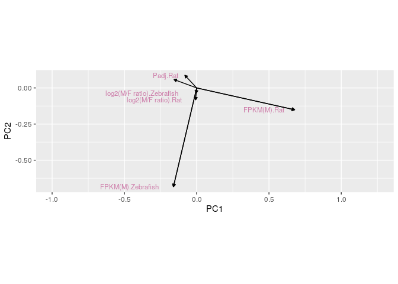
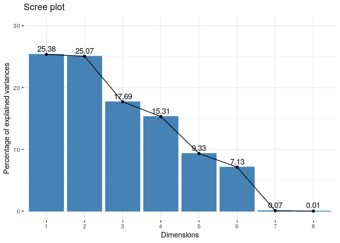

A Study of Sex Associated Traits in Brown Rats and Zebrafish
================
Isaac Ramos

-----

**Introduction**: Both data sets are from a large data bank pooled from
a study published in 2018 called *SAGD: a comprehensive sex-associated
gene database from transcriptomes*. The data sets selected were from a
sequencing of sex associated genes derived from the Brown Rat and the
Zebrafish, or *Rattus norvegicus* and *Danio rerio* respectively. Both
data sets come from genes which code for traits in the brain of both
species in order for comparison statistics to hold some weight when
being interpreted. Each dataset contained the variables: “Gene ID”,
which was a long sequence of letters and numbers coordinating to
specific genes that code for the brain tissue, “Symbol” which was a much
shorter way of making distinctions between the genes, “FPKM(M)” and
“FPKM(F)” which stands for Fragments Per Kilobase of transcript per
Million mapped reads (This is a standard measure taken in RNA and DNA
sequencing), “Chromosome” which detailed which chromosome the gene could
be found on, “log2(M/F ratio)” which was the bias each gene was found in
either sex, and “Padj” which is a statistic term meant to reduce Type 1
errors. This data interested me because I love genetics of all kinds. I
like diving into even the most simple of things, such as length of the
DNA read and seeing how it differs from humans, or in this case
Zebrafish. The datasets provide a comprehensive look at the genetics of
sex associated traits, from a data and number standpoint.

-----

``` r
#Keep only the Chromosomes for Zebrafish
FishKaryotype <- c("1","2","3","4","5","6","7","8",
                   "9","10","11","12","13","14","15",
                   "16","17","18","19","20","21","22",
                   "23","24","25","26","27","28",
                   "29","30","X","Y")
#Clean 
Fish_Clean <- Zebrafish %>% filter(Chromosome %in% FishKaryotype) %>%
  drop_na()

#Keep only the Chromosomes for Rats
RatKaryotype <- c("1","2","3","4","5","6","7","8","9","10",
                  "11","12","13","14","15","16","17","18",
                  "19","20","21","22","23","24","25","26",
                  "27","28","29","30","X","Y")
#Clean
Rat_Clean <- Rat %>% filter(Chromosome %in% RatKaryotype) %>%
  drop_na()

#Lets take a look 
head(Fish_Clean)
```

    ## # A tibble: 6 x 9
    ##   `Gene ID` Symbol `SAGD Group` Species `FPKM(M)` `FPKM(F)` Chromosome
    ##   <chr>     <chr>  <chr>        <chr>       <dbl>     <dbl> <chr>     
    ## 1 ENSDARG0… dio2   SAGD_00136   Zebraf…    51.8     18.9    17        
    ## 2 ENSDARG0… gnat1  SAGD_00136   Zebraf…     2.03     7.10   6         
    ## 3 ENSDARG0… galn   SAGD_00136   Zebraf…    22.1     13.1    25        
    ## 4 ENSDARG0… si:ch… SAGD_00136   Zebraf…    35.2     51.9    7         
    ## 5 ENSDARG0… si:ch… SAGD_00136   Zebraf…     0.144    1.12   17        
    ## 6 ENSDARG0… myhb   SAGD_00136   Zebraf…     0.448    0.0452 6         
    ## # … with 2 more variables: `log2(M/F ratio)` <dbl>, Padj <dbl>

``` r
head(Rat_Clean)
```

    ## # A tibble: 6 x 9
    ##   `Gene ID` Symbol `SAGD Group` Species `FPKM(M)` `FPKM(F)` Chromosome
    ##   <chr>     <chr>  <chr>        <chr>       <dbl>     <dbl> <chr>     
    ## 1 ENSRNOG0… Ddx3   SAGD_00113   Rat         26.4    0.0567  Y         
    ## 2 ENSRNOG0… Eif2s… SAGD_00113   Rat         34.0    0.0771  Y         
    ## 3 ENSRNOG0… Kdm5d  SAGD_00113   Rat         11.1    0.0287  Y         
    ## 4 ENSRNOG0… AC239… SAGD_00113   Rat          1.74   0.149   Y         
    ## 5 ENSRNOG0… AC241… SAGD_00113   Rat          3.93   0.00204 Y         
    ## 6 ENSRNOG0… Eif2s3 SAGD_00113   Rat         36.3   54.2     X         
    ## # … with 2 more variables: `log2(M/F ratio)` <dbl>, Padj <dbl>

*These are our 2 data sets. They are from a data base, which examines
sexually selected traits and the deemed significant information behind
them. The way I reshaped the data was by dropping all of the NA values
and filtering out anything not found in the karyotype of both species.*

``` r
#Joining by chromosome
FullData <- full_join(Rat_Clean,
                      Fish_Clean, by = "Chromosome", 
                      suffix = c(".Rat", ".Zebrafish"))

FullData_Clean <- FullData %>% drop_na()
```

*We utilized a full join for the combination of the two data sets,
Rat\_Clean and Fish\_Clean. We chose this method of merging the data
sets because we wanted to look into the differences in the chromosomal
information, per chromosome, of the two species. In order to do this in
the most effective way, we need as much data as possible, thus a full
join was necessary. While the total number of observations deleted by
dropping the NA values was high, proportionally we did not drop many
data points from the data set.*

``` r
FullData_Clean %>% group_by(Chromosome) %>% summarise(Symbol.Zebrafish = n()) %>% arrange(Symbol.Zebrafish)
```

    ## `summarise()` ungrouping output (override with `.groups` argument)

    ## # A tibble: 20 x 2
    ##    Chromosome Symbol.Zebrafish
    ##    <chr>                 <int>
    ##  1 18                   289978
    ##  2 11                   319200
    ##  3 15                   391776
    ##  4 12                   392274
    ##  5 17                   392766
    ##  6 14                   414936
    ##  7 19                   422145
    ##  8 20                   430606
    ##  9 13                   459940
    ## 10 16                   497904
    ## 11 9                    514995
    ## 12 6                    736210
    ## 13 8                    893165
    ## 14 10                  1000890
    ## 15 4                   1121225
    ## 16 7                   1138792
    ## 17 5                   1269844
    ## 18 2                   1284843
    ## 19 3                   1367436
    ## 20 1                   2116632

*From the table above, we can determine the amount of different genes
per chromosome in the data for the Zebrafish. The chromosome with the
least amount of sex associated genes is chromosome 18 while the one with
the most is chromosome 1. *

``` r
#Filter for Chromosome 5
Chromosome5 <- FullData_Clean %>%
  filter(Chromosome == "5") %>% 
  select(`log2(M/F ratio).Rat`,`log2(M/F ratio).Zebrafish`, Symbol.Rat,
         Symbol.Zebrafish) %>% 
  arrange(Symbol.Zebrafish) 

#Calculate the mean of the Bias on Sex
Chromosome5 %>% 
  summarize(MeanBias.Fish = mean(`log2(M/F ratio).Zebrafish`),
            MeanBias.Rat = mean(`log2(M/F ratio).Rat`))
```

    ## # A tibble: 1 x 2
    ##   MeanBias.Fish MeanBias.Rat
    ##           <dbl>        <dbl>
    ## 1        0.0319       0.0529

*If the log2 of the male to female ratio results in a negative number,
the trait is more biased towards females. The opposite is true of a
positive value for the log2 of the M/F ratio.*

*Based on the means of both ratios we can see there is a slight bias
towards males, in both Zebrafish and Rats, in the sex-associated genes
for the brains of both species.*

``` r
Statsignificant <- FullData_Clean %>% 
  #Group by Chromosome
  group_by(Chromosome) %>% 
  #Create a variable of the summarized PADJ values
  mutate(Significance.Zebrafish = min_rank(Padj.Zebrafish)) %>%
  #Keep the Species and gene symbol for identification purposes
  select(Symbol.Rat,Symbol.Zebrafish,Chromosome,Significance.Zebrafish) %>%
  arrange(desc(Significance.Zebrafish))

#Take a look at the data 
head(Statsignificant,10)
```

    ## # A tibble: 10 x 4
    ## # Groups:   Chromosome [1]
    ##    Symbol.Rat Symbol.Zebrafish Chromosome Significance.Zebrafish
    ##    <chr>      <chr>            <chr>                       <int>
    ##  1 Tph1       itsn1            1                           25785
    ##  2 Tph1       dnah6            1                           25785
    ##  3 Tph1       mhc1zea          1                           25785
    ##  4 Tph1       atp1a1a.4        1                           25785
    ##  5 Tph1       chmp2bb          1                           25785
    ##  6 Tph1       mcoln1a          1                           25785
    ##  7 Tph1       mief2            1                           25785
    ##  8 Tph1       b4galt1          1                           25785
    ##  9 Tph1       atp1a1a.1        1                           25785
    ## 10 Tph1       si:dkey-28b4.8   1                           25785

*From this data frame we can see the Chromosome which had the largest
Padj values, or the largest p-values were all associated with Chromosome
one of the Zebra fish.*

``` r
Chromosome3 <- FullData_Clean %>% 
#Filter for Chromosome 3
  filter(Chromosome == "3") %>% 
#Take the SD, Variance and MAD of the Bias for Zebrafish
  summarize(SD_MFratio.Zebrafish = sd(`log2(M/F ratio).Zebrafish`),
            Variance.Of.MFRatio.Zebrafish = var(`log2(M/F ratio).Zebrafish`),
            MAD.Zebrafish = mad(`log2(M/F ratio).Zebrafish`))
#Visualized
Chromosome3
```

    ## # A tibble: 1 x 3
    ##   SD_MFratio.Zebrafish Variance.Of.MFRatio.Zebrafish MAD.Zebrafish
    ##                  <dbl>                         <dbl>         <dbl>
    ## 1                0.572                         0.327         0.143

*All three measures of spread showed the data points were all close to
the mean of with the mad being an low value of .1429486. Lets look into
if this is due to the number of data points or are all of the values
actually close to the mean. *

``` r
#Filter for Chromosome 3
FullData_Clean %>% filter(Chromosome == "3") %>% 
#Take the Max and Min of the Ratio 
  summarize(MaxRatio = max(`log2(M/F ratio).Zebrafish`), 
            MinRatio = min(`log2(M/F ratio).Zebrafish`))
```

    ## # A tibble: 1 x 2
    ##   MaxRatio MinRatio
    ##      <dbl>    <dbl>
    ## 1     5.41    -4.95

*Based on the information above, we can see the low standard deviation
comes from a sheer large number of observations, lowering the SD and the
MAD. This can be understood through the Max Bias being 5.41 and the
“Minimal” Bias being -4.96 we say minimal in quotations because the
negative sign represents bias towards females for that locus. *

``` r
FullData_Clean %>% summarize(n_distinct(Symbol.Rat),
                             n_distinct(Symbol.Zebrafish))
```

    ## # A tibble: 1 x 2
    ##   `n_distinct(Symbol.Rat)` `n_distinct(Symbol.Zebrafish)`
    ##                      <int>                          <int>
    ## 1                    17320                          16188

*The *Rattus norvegicus* has more sex associated genes in the brain than
the Zebrafish. We can draw this conclusion due to the Brown Rat having
more unique entries in the Symbol for the gene variable.*

``` r
#
FullData_Clean %>% 
  summarise(Cor_Male_Female_FPKM.Rat = cor(`FPKM(M).Rat`,`FPKM(F).Rat`), 
            Cor_Male_Female_FPKM.Fish = cor(`FPKM(M).Zebrafish`,
                                            `FPKM(F).Zebrafish`))
```

    ## # A tibble: 1 x 2
    ##   Cor_Male_Female_FPKM.Rat Cor_Male_Female_FPKM.Fish
    ##                      <dbl>                     <dbl>
    ## 1                    0.998                     0.997

*Based on the table above we can see there is an immensely strong
correlation between the FPKM (Fragments per Fragments Per Kilobase of
transcript per Million mapped reads) values for both sexes in both
species.*

``` r
#Keep Numeric Variables
FullData_Num <- FullData_Clean %>% select_if(is.numeric)
#Create a custom color
custom_color <- c("#F4EDCA")
#Save the cor as a data frame 
cor(FullData_Num, use = "pairwise.complete.obs") %>% 
  as.data.frame %>% 
# Convert row names to an explicit variable
  rownames_to_column %>% 
  # Pivot so that all correlations appear in the same column
  pivot_longer(-1, names_to = "other_var", 
               values_to = "correlation") %>%
  # Heatmap with geom_tile
  ggplot(aes(rowname, other_var, fill=correlation)) +
  geom_tile() +  
  # Change the scale 
  scale_color_viridis(option = "D") + 
  #Overlay
  geom_text(aes(label = round(correlation,2)), 
            color = custom_color, size = 4,
            check_overlap = TRUE) + 
  #Creat labels 
  labs(title = "Correlation matrix", x = "variable 1", y = "variable 2")
```

<!-- -->

*From this Heatmap of the correlation matrix we can see there is very
little correlation between the numeric variables. However there seems to
be a slightly strong negative correlation between Padj.Rat and the ratio
of M/F bias in Rats.*

``` r
#Creat the data for the scatterplot
scat <- FullData_Clean %>%
  #Selected the Species, Chromosome and the Sex Bias ratio 
  select(Species.Rat,Species.Zebrafish,Chromosome,
         `log2(M/F ratio).Rat`,
         `log2(M/F ratio).Zebrafish`)

#Pivot
scat <- scat %>% 
  pivot_longer(cols = c(Species.Rat,Species.Zebrafish), 
               names_to = "remove", values_to = "Species")

#Remove a dummy variable
scat <- scat %>% select(-remove)
#Take a random sample so RStudio can process code
samp1 <- sample_n(scat, 100)

#Create the scatterplot with the sample
scatPlot1 <- samp1 %>% 
  ggplot(aes(`log2(M/F ratio).Rat`,
             `log2(M/F ratio).Zebrafish`)) +
  #Have color coordinate with Species
  geom_point(aes(color = Species)) +
  scale_color_brewer(palette = "Set2") +
  #Creat labels
  labs(title = "A Look into the Bias of Genes in Each Species")


scatPlot1
```

<!-- -->

*A sample of 100 rows of data was taken because if we used the entire
filtered data set the plot would be almost an entire gigabyte. From this
sample we can see there is no large discrepancy between the Male to
Female ratio of sex associated bias between the two species.*

``` r
#Clean up Boxplot Data
BPData <- FullData_Clean %>%
  select(-`Gene ID.Rat`,-`Gene ID.Zebrafish`,
         -Symbol.Rat,-Symbol.Zebrafish,-Padj.Rat,-Padj.Zebrafish,
         -`SAGD Group.Rat`,-`SAGD Group.Zebrafish`)

#Pivot
BPData <- BPData %>% 
  pivot_longer(cols = c(Species.Rat,Species.Zebrafish),
               names_to = "remove", values_to = "Species")

#Perform more cleaning
BPData <- BPData %>%
  select(-remove,-`log2(M/F ratio).Zebrafish`,
         -`log2(M/F ratio).Rat`,-`FPKM(M).Rat`,
         -`FPKM(M).Zebrafish`)

#Take a sample so RStudio does not suffer
samp2 <- sample_n(BPData, 1000)

#Pivot and remove dummy variable
FinalBPData <- samp2 %>%
  pivot_longer(cols = c(`FPKM(F).Rat`,`FPKM(F).Zebrafish`),
               names_to = "D", values_to = "FPKM") %>% 
  select(-D)

#Custom color and labels
BoxP <- FinalBPData %>% 
  ggplot(aes(x = Chromosome, y = FPKM, fill = Species)) +
  geom_boxplot() + 
  scale_fill_brewer(palette = "Set2") +
  labs(title = "FPKM for Females of the Species") + 
  ylim(0,40)


BoxP
```

<<<<<<< HEAD
    ## Warning: Removed 126 rows containing non-finite values (stat_boxplot).
=======
<<<<<<< HEAD
    ## Warning: Removed 126 rows containing non-finite values (stat_boxplot).
=======
    ## Warning: Removed 172 rows containing non-finite values (stat_boxplot).
>>>>>>> 5b84bc0c2428946d68044b04322ef88f8de23017
>>>>>>> 663602506cdc5205df009e9cd725837ded81795c

<!-- -->

*The multitude of boxplots above show the FPKM values at each chromosome
for each species in the data set. Similar to how we constructed the
above scatterplot, a random sample of the data set was taken in order
for RStudio to actually be able to create the ggplot and keep the plot
at a reasonable size. Despite the few outliers, the majority of the RNA
sequences was below 40 Fragments(per million). The graph looked at
specifically Female individuals of the species. *

``` r
#Take a sample to prevent an Rstudio meltdown 
pca_samp <- sample_n(FullData_Clean, 1000) 


#Clean up the data for a PCA
pcaRNA <- pca_samp  %>% 
  select_if(is.numeric) %>% 
  scale %>% 
  prcomp


names(pcaRNA)
```

    ## [1] "sdev"     "rotation" "center"   "scale"    "x"

``` r
pcaRNA
```

    ## Standard deviations (1, .., p=8):
<<<<<<< HEAD
=======
<<<<<<< HEAD
>>>>>>> 663602506cdc5205df009e9cd725837ded81795c
    ## [1] 1.42478828 1.41610034 1.18975860 1.10685140 0.86417435 0.75512242 0.07613810
    ## [8] 0.03447393
    ## 
    ## Rotation (n x k) = (8 x 8):
    ##                                    PC1         PC2         PC3           PC4
    ## FPKM(M).Rat                0.678105764 -0.15114826  0.07445685 -0.0648892342
    ## FPKM(F).Rat                0.675988233 -0.15105802  0.09228236 -0.0639277381
    ## log2(M/F ratio).Rat       -0.007280312 -0.08270257 -0.67142384 -0.1769666772
    ## Padj.Rat                  -0.081883256  0.08789968  0.67540871  0.1706180200
    ## FPKM(M).Zebrafish         -0.160925204 -0.68401777  0.07742949 -0.0009365448
    ## FPKM(F).Zebrafish         -0.161096212 -0.68356515  0.07910209 -0.0187176182
    ## log2(M/F ratio).Zebrafish -0.003144745 -0.03547464 -0.09672864  0.7295383247
    ## Padj.Zebrafish            -0.156830519  0.05804771  0.23946680 -0.6314249951
    ##                                    PC5           PC6          PC7           PC8
    ## FPKM(M).Rat               -0.079292682  0.0145827993  0.707788454  0.0103854474
    ## FPKM(F).Rat               -0.093552618  0.0141685629 -0.706087189 -0.0103264262
    ## log2(M/F ratio).Rat       -0.322165925  0.6380888667 -0.005498972 -0.0012584920
    ## Padj.Rat                  -0.155931895  0.6898288602  0.010133255 -0.0002151960
    ## FPKM(M).Zebrafish          0.009546793 -0.0057525908  0.011436431 -0.7070866546
    ## FPKM(F).Zebrafish          0.023659709  0.0008670988 -0.009410227  0.7067744503
    ## log2(M/F ratio).Zebrafish -0.637107930 -0.2256764450  0.005524782  0.0167978409
    ## Padj.Zebrafish            -0.671042101 -0.2561281584  0.009674504 -0.0002217383
<<<<<<< HEAD
=======
=======
    ## [1] 1.49591100 1.39596349 1.23834435 1.09815719 0.88240708 0.53808415 0.06425441
    ## [8] 0.04224749
    ## 
    ## Rotation (n x k) = (8 x 8):
    ##                                   PC1         PC2         PC3         PC4
    ## FPKM(M).Rat                0.46637194 -0.43620687  0.30221289 -0.01683292
    ## FPKM(F).Rat                0.45944942 -0.44371923  0.30378886 -0.01744341
    ## log2(M/F ratio).Rat        0.09185326  0.46076991  0.52070733  0.06195966
    ## Padj.Rat                  -0.08465466 -0.44816238 -0.53729095 -0.05541895
    ## FPKM(M).Zebrafish          0.52607611  0.30379392 -0.35843571  0.04888161
    ## FPKM(F).Zebrafish          0.52550070  0.30716385 -0.35432580  0.06253753
    ## log2(M/F ratio).Zebrafish  0.03432321  0.04019334 -0.02539169 -0.71312536
    ## Padj.Zebrafish            -0.04141089 -0.10687610 -0.04352409  0.69112516
    ##                                     PC5           PC6           PC7
    ## FPKM(M).Rat                0.0032865449 -0.0107018941 -7.016833e-01
    ## FPKM(F).Rat                0.0046367477  0.0003389879  7.007949e-01
    ## log2(M/F ratio).Rat       -0.0449742585 -0.7086490732  8.260239e-03
    ## Padj.Rat                   0.0523608439 -0.7053142919  2.787438e-03
    ## FPKM(M).Zebrafish          0.0005916361  0.0097918333  9.508462e-02
    ## FPKM(F).Zebrafish         -0.0017670799  0.0099499199 -8.607200e-02
    ## log2(M/F ratio).Zebrafish -0.6985293497 -0.0061100178  7.784921e-05
    ## Padj.Zebrafish            -0.7122195113 -0.0011755474  1.223951e-03
    ##                                    PC8
    ## FPKM(M).Rat               -0.090110823
    ## FPKM(F).Rat                0.091062609
    ## log2(M/F ratio).Rat       -0.002127470
    ## Padj.Rat                   0.003683855
    ## FPKM(M).Zebrafish         -0.700678457
    ## FPKM(F).Zebrafish          0.701805634
    ## log2(M/F ratio).Zebrafish  0.005771524
    ## Padj.Zebrafish            -0.007401679
>>>>>>> 5b84bc0c2428946d68044b04322ef88f8de23017
>>>>>>> 663602506cdc5205df009e9cd725837ded81795c

``` r
#Rotated Data
head(pcaRNA$x)
```

<<<<<<< HEAD
=======
<<<<<<< HEAD
>>>>>>> 663602506cdc5205df009e9cd725837ded81795c
    ##             PC1        PC2         PC3         PC4         PC5         PC6
    ## [1,] -0.9773148 -2.0199202 -0.17067541 -0.18433653 -0.14375803  0.42648495
    ## [2,]  0.4462170  0.4997469  0.41984446 -0.41622482  0.31516001  0.04520850
    ## [3,] -0.5574651 -0.2025911  0.43792110  0.02002849  0.06948866  0.08758866
    ## [4,] -0.4319878  0.6670876 -0.04898642  0.18998644 -0.30637545  0.31855506
    ## [5,] -0.4284349  0.6128184  0.24439172  0.76844291 -0.48628841 -0.37625055
    ## [6,]  0.9083309  0.1097972  0.18252491  0.03144168 -0.32081391  0.01537481
    ##              PC7          PC8
    ## [1,]  0.01900307  0.041113975
    ## [2,] -0.03787523 -0.005441282
    ## [3,]  0.01359385  0.018832412
    ## [4,]  0.01800518  0.003613754
    ## [5,]  0.01973489  0.004660512
    ## [6,] -0.01709536 -0.003867910
<<<<<<< HEAD
=======
=======
    ##              PC1        PC2         PC3         PC4          PC5         PC6
    ## [1,] -0.68119361 -0.1966548 -0.24454723  0.08860199  0.009608554 -0.08301847
    ## [2,] -0.26158149 -0.5147692  0.06280925  0.16432641  0.087733124 -0.15626254
    ## [3,]  0.08256043 -0.9656633  0.32789741 -0.03755244 -0.076965738  0.04342528
    ## [4,] -0.62120512 -0.1959947 -0.24039927  0.12732060  0.043374454 -0.12158514
    ## [5,] -0.49683588 -0.2108061 -0.13450394 -0.03185364 -0.122450797 -0.15442558
    ## [6,] -0.45144962 -0.5244352 -0.01143636 -0.39502720 -0.438073818 -0.09732282
    ##                PC7           PC8
    ## [1,] -0.0071642900 -0.0012056234
    ## [2,] -0.0006570093  0.0031425104
    ## [3,]  0.0427309191  0.0027926676
    ## [4,] -0.0066692500  0.0016791815
    ## [5,] -0.0073007670 -0.0042332159
    ## [6,]  0.0065055973 -0.0004732963
>>>>>>> 5b84bc0c2428946d68044b04322ef88f8de23017
>>>>>>> 663602506cdc5205df009e9cd725837ded81795c

``` r
pcaRNA_data <- data.frame(pcaRNA$x, 
  Chromosome = pca_samp$Chromosome)

head(pcaRNA_data)
```

<<<<<<< HEAD
=======
<<<<<<< HEAD
>>>>>>> 663602506cdc5205df009e9cd725837ded81795c
    ##          PC1        PC2         PC3         PC4         PC5         PC6
    ## 1 -0.9773148 -2.0199202 -0.17067541 -0.18433653 -0.14375803  0.42648495
    ## 2  0.4462170  0.4997469  0.41984446 -0.41622482  0.31516001  0.04520850
    ## 3 -0.5574651 -0.2025911  0.43792110  0.02002849  0.06948866  0.08758866
    ## 4 -0.4319878  0.6670876 -0.04898642  0.18998644 -0.30637545  0.31855506
    ## 5 -0.4284349  0.6128184  0.24439172  0.76844291 -0.48628841 -0.37625055
    ## 6  0.9083309  0.1097972  0.18252491  0.03144168 -0.32081391  0.01537481
    ##           PC7          PC8 Chromosome
    ## 1  0.01900307  0.041113975          4
    ## 2 -0.03787523 -0.005441282         16
    ## 3  0.01359385  0.018832412         14
    ## 4  0.01800518  0.003613754         19
    ## 5  0.01973489  0.004660512          2
    ## 6 -0.01709536 -0.003867910         13
<<<<<<< HEAD
=======
=======
    ##           PC1        PC2         PC3         PC4          PC5         PC6
    ## 1 -0.68119361 -0.1966548 -0.24454723  0.08860199  0.009608554 -0.08301847
    ## 2 -0.26158149 -0.5147692  0.06280925  0.16432641  0.087733124 -0.15626254
    ## 3  0.08256043 -0.9656633  0.32789741 -0.03755244 -0.076965738  0.04342528
    ## 4 -0.62120512 -0.1959947 -0.24039927  0.12732060  0.043374454 -0.12158514
    ## 5 -0.49683588 -0.2108061 -0.13450394 -0.03185364 -0.122450797 -0.15442558
    ## 6 -0.45144962 -0.5244352 -0.01143636 -0.39502720 -0.438073818 -0.09732282
    ##             PC7           PC8 Chromosome
    ## 1 -0.0071642900 -0.0012056234          9
    ## 2 -0.0006570093  0.0031425104         13
    ## 3  0.0427309191  0.0027926676          1
    ## 4 -0.0066692500  0.0016791815         10
    ## 5 -0.0073007670 -0.0042332159         14
    ## 6  0.0065055973 -0.0004732963          5
>>>>>>> 5b84bc0c2428946d68044b04322ef88f8de23017
>>>>>>> 663602506cdc5205df009e9cd725837ded81795c

``` r
#Visualization
ggplot(pcaRNA_data, aes(x = PC1, y = PC2, color = Chromosome)) +
  geom_point() +
  theme(legend.position = "bottom")
```

<!-- -->

``` r
#Rotation Matrix
pcaRNA$rotation
```

<<<<<<< HEAD
=======
<<<<<<< HEAD
>>>>>>> 663602506cdc5205df009e9cd725837ded81795c
    ##                                    PC1         PC2         PC3           PC4
    ## FPKM(M).Rat                0.678105764 -0.15114826  0.07445685 -0.0648892342
    ## FPKM(F).Rat                0.675988233 -0.15105802  0.09228236 -0.0639277381
    ## log2(M/F ratio).Rat       -0.007280312 -0.08270257 -0.67142384 -0.1769666772
    ## Padj.Rat                  -0.081883256  0.08789968  0.67540871  0.1706180200
    ## FPKM(M).Zebrafish         -0.160925204 -0.68401777  0.07742949 -0.0009365448
    ## FPKM(F).Zebrafish         -0.161096212 -0.68356515  0.07910209 -0.0187176182
    ## log2(M/F ratio).Zebrafish -0.003144745 -0.03547464 -0.09672864  0.7295383247
    ## Padj.Zebrafish            -0.156830519  0.05804771  0.23946680 -0.6314249951
    ##                                    PC5           PC6          PC7           PC8
    ## FPKM(M).Rat               -0.079292682  0.0145827993  0.707788454  0.0103854474
    ## FPKM(F).Rat               -0.093552618  0.0141685629 -0.706087189 -0.0103264262
    ## log2(M/F ratio).Rat       -0.322165925  0.6380888667 -0.005498972 -0.0012584920
    ## Padj.Rat                  -0.155931895  0.6898288602  0.010133255 -0.0002151960
    ## FPKM(M).Zebrafish          0.009546793 -0.0057525908  0.011436431 -0.7070866546
    ## FPKM(F).Zebrafish          0.023659709  0.0008670988 -0.009410227  0.7067744503
    ## log2(M/F ratio).Zebrafish -0.637107930 -0.2256764450  0.005524782  0.0167978409
    ## Padj.Zebrafish            -0.671042101 -0.2561281584  0.009674504 -0.0002217383
<<<<<<< HEAD
=======
=======
    ##                                   PC1         PC2         PC3         PC4
    ## FPKM(M).Rat                0.46637194 -0.43620687  0.30221289 -0.01683292
    ## FPKM(F).Rat                0.45944942 -0.44371923  0.30378886 -0.01744341
    ## log2(M/F ratio).Rat        0.09185326  0.46076991  0.52070733  0.06195966
    ## Padj.Rat                  -0.08465466 -0.44816238 -0.53729095 -0.05541895
    ## FPKM(M).Zebrafish          0.52607611  0.30379392 -0.35843571  0.04888161
    ## FPKM(F).Zebrafish          0.52550070  0.30716385 -0.35432580  0.06253753
    ## log2(M/F ratio).Zebrafish  0.03432321  0.04019334 -0.02539169 -0.71312536
    ## Padj.Zebrafish            -0.04141089 -0.10687610 -0.04352409  0.69112516
    ##                                     PC5           PC6           PC7
    ## FPKM(M).Rat                0.0032865449 -0.0107018941 -7.016833e-01
    ## FPKM(F).Rat                0.0046367477  0.0003389879  7.007949e-01
    ## log2(M/F ratio).Rat       -0.0449742585 -0.7086490732  8.260239e-03
    ## Padj.Rat                   0.0523608439 -0.7053142919  2.787438e-03
    ## FPKM(M).Zebrafish          0.0005916361  0.0097918333  9.508462e-02
    ## FPKM(F).Zebrafish         -0.0017670799  0.0099499199 -8.607200e-02
    ## log2(M/F ratio).Zebrafish -0.6985293497 -0.0061100178  7.784921e-05
    ## Padj.Zebrafish            -0.7122195113 -0.0011755474  1.223951e-03
    ##                                    PC8
    ## FPKM(M).Rat               -0.090110823
    ## FPKM(F).Rat                0.091062609
    ## log2(M/F ratio).Rat       -0.002127470
    ## Padj.Rat                   0.003683855
    ## FPKM(M).Zebrafish         -0.700678457
    ## FPKM(F).Zebrafish          0.701805634
    ## log2(M/F ratio).Zebrafish  0.005771524
    ## Padj.Zebrafish            -0.007401679
>>>>>>> 5b84bc0c2428946d68044b04322ef88f8de23017
>>>>>>> 663602506cdc5205df009e9cd725837ded81795c

``` r
rotation_data <- data.frame(pcaRNA$rotation, 
  variable = row.names(pcaRNA$rotation))

#Visualization
arrowRNA <- arrow(length = unit(0.05, "inches"), type = "closed")
color2 <- c("#CC79A7")

ggplot(rotation_data) +
  geom_segment(aes(xend = PC1, yend = PC2),
               x = 0, y = 0,
               arrow = arrowRNA) +
  geom_text(aes(x = PC1, y = PC2, label = variable),
            hjust = 1.25, size = 3, color = color2,
            check_overlap = TRUE) +
  xlim(-1., 1.25) + coord_fixed()
```

<!-- -->

``` r
#Variance explained by each PC from SD 
percent <- 100* (pcaRNA$sdev^2 / sum(pcaRNA$sdev^2))
percent
```

<<<<<<< HEAD
    ## [1] 25.37527064 25.06675232 17.69406901 15.31400016  9.33496626  7.12762333
    ## [7]  0.07246264  0.01485565
=======
<<<<<<< HEAD
    ## [1] 25.37527064 25.06675232 17.69406901 15.31400016  9.33496626  7.12762333
    ## [7]  0.07246264  0.01485565
=======
    ## [1] 27.97187161 24.35892573 19.16870900 15.07436513  9.73302811  3.61918192
    ## [7]  0.05160787  0.02231063
>>>>>>> 5b84bc0c2428946d68044b04322ef88f8de23017
>>>>>>> 663602506cdc5205df009e9cd725837ded81795c

``` r
perc_data <- data.frame(percent = percent,
                        PC = 1:length(percent))
#Visualization
ggplot(perc_data, aes(x = PC, y = percent)) + 
   geom_col() + geom_text(aes(label = round(percent, 2)),
                           size = 4, vjust = -0.5) +
  ylim(0,35)
```

<!-- -->

``` r
#A scree plot for a more effective visual
fviz_screeplot(pcaRNA) + 
  geom_text(aes(label = round(percent, 2)), 
            size = 4, vjust = -0.5, check_overlap = TRUE) +
  ylim(0,30)
```

<!-- -->

*About half of the variance can be explained from the first two
principle components. About 99% of the variation comes from six out of
the eight PC’s. The scree plot shows a steady to sharp decreas in
percentage of explained variance moving left to right.*

-----

References:

Meng-Wei Shi, Na-An Zhang, Chuan-Ping Shi, Chun-Jie Liu, Zhi-Hui Luo,
Dan-Yang Wang, An-Yuan Guo, Zhen-Xia Chen, SAGD: a comprehensive
sex-associated gene database from transcriptomes, Nucleic Acids
Research, Volume 47, Issue D1, 08 January 2019, Pages D835–D840,
<https://doi.org/10.1093/nar/gky1040>

-----
