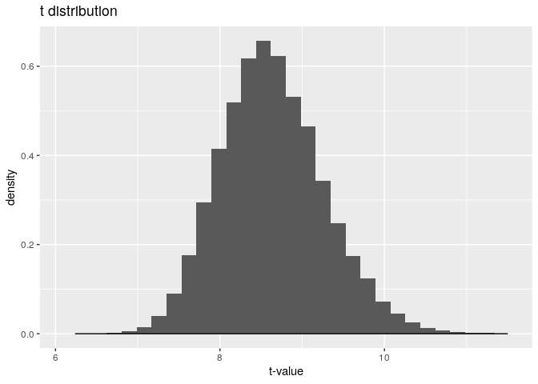

A Deeper Look into Sex Associated Genes in Humans in the Hypothalamus
================
Isaac Ramos

``` r
#odds function for logistic
odds <- function(p)p/(1-p)

#logit
logit <- function(p) log(odds(p))


#sens and spec formulas
sensF <- function(p, data = data, y = y) mean(data[data$y == 1, ]$prob1 > p)
specF <- function(p, data = data, y = y) mean(data[data$y == 0, ]$prob1 <= p)

options(dplyr.summarise.inform = FALSE)
hypothalamus <- read_csv("SAGD_00055.csv")
```

    ## 
    ## ── Column specification ────────────────────────────────────────────────────────
    ## cols(
    ##   `Gene ID` = col_character(),
    ##   Symbol = col_character(),
    ##   `SAGD Group` = col_character(),
    ##   Species = col_character(),
    ##   `FPKM(M)` = col_double(),
    ##   `FPKM(F)` = col_double(),
    ##   Chromosome = col_character(),
    ##   `log2(M/F ratio)` = col_double(),
    ##   Padj = col_double()
    ## )

``` r
hypo_clean <- hypothalamus %>% na.omit %>%
  select(-`Gene ID`,-Species,-`SAGD Group`,-Padj)
```

-----

**Introduction:** The data set is from a large data bank pooled from a
study published in 2018 called *SAGD: a comprehensive sex-associated
gene database from transcriptomes*. The data set selected is from a
sequencing of sex associated genes derived from humans\! The specific
organ is the brain, the section of the brain called the hypothalamus.
This data set had a plethora of not very important or descriptive
variables, so I trimmed the number of variables down to 5. This selected
five included: “Symbol” which is used as the identification for the
locus, “FPKM(M)” and “FPKM(F)” which stands for Fragments Per Kilobase
of transcript per Million mapped reads male and female, respectively,
and is a standard measure taken in RNA and DNA sequencing, “Chromosome”
which is a categorical variable detailing which chromosome the locus can
be found on, and finally “log2(M/F ratio)” which detailed the sex bias
of the gene. This data set is interesting to me because I enjoy looking
at genetic information. Being able to compare different details about
sex based genetic information which could possibly lead to predictions
based off of simple statistics is intriguing. I expect to see weak
relationships between all of the variables, but it would be interesting
to learn if certain chromosome has something to do with sex bias.
(Besides Y of course\!)

``` r
#correlation matrix 
hypo_num <- hypo_clean %>% select_if(is.numeric) 
cor(hypo_num, use = "pairwise.complete.obs")
```

    ##                     FPKM(M)     FPKM(F) log2(M/F ratio)
    ## FPKM(M)         1.000000000 0.997498278     0.006656034
    ## FPKM(F)         0.997498278 1.000000000     0.005719443
    ## log2(M/F ratio) 0.006656034 0.005719443     1.000000000

``` r
#heatmap
daHeat <- cor(hypo_num, use = "pairwise.complete.obs") %>%
  as.data.frame %>%
  rownames_to_column %>%
  pivot_longer(-1, names_to = "other_var", values_to = "correlation") %>%
  ggplot(aes(rowname, other_var, fill=correlation)) +
  scale_fill_viridis() +
  geom_tile() +
  geom_text(aes(label = round(correlation,4)), color = "black", size = 4) +
  labs(title = "Correlation matrix", x = "variable 1", y = "variable 2")

daHeat
```

<!-- -->

``` r
#FPKM male vs female
chromo <- c("1","2","3","4","5","6","7","8","9","10","11","12","13","14","15","16","17","18","19","20","21","22","23","X","Y")

hypo_clean %>% filter(Chromosome %in% chromo) %>% 
  ggplot(aes(`FPKM(M)`,`FPKM(F)`)) + geom_point(aes(color = Chromosome)) +
  labs(title = "FPKM Male vs Female")
```

<!-- -->

The correlation between the FPKM being very strong makes sense as the
number of fragments should not have a large variation between sexes,
thus if you know one sexes fragment number you know the other sexes.

Additionally, the relationship between the fragments can be seen in the
scatterplot below the correlation heatmap. There is a strong positive
correlation between the fragment lengths of genes found in both males
and females.

``` r
hypo_clean %>% filter(Chromosome %in% chromo) %>% 
  ggplot(aes(Chromosome, fill = Chromosome)) + 
  geom_bar() + labs(title = "Amount of Loci at Each Chromosome")
```

<!-- -->

The majority of sex associated genes for the hypothalamus in humans are
on the 1st and 2nd chromosome. Furthermore, there are a large number of

``` r
summary(hypo_clean)
```

    ##     Symbol             FPKM(M)            FPKM(F)          Chromosome       
    ##  Length:47605       Min.   :    0.00   Min.   :    0.00   Length:47605      
    ##  Class :character   1st Qu.:    0.01   1st Qu.:    0.02   Class :character  
    ##  Mode  :character   Median :    0.12   Median :    0.14   Mode  :character  
    ##                     Mean   :   10.54   Mean   :   10.30                     
    ##                     3rd Qu.:    1.54   3rd Qu.:    1.66                     
    ##                     Max.   :45417.62   Max.   :49131.78                     
    ##  log2(M/F ratio)    
    ##  Min.   :-7.763100  
    ##  1st Qu.:-0.205860  
    ##  Median :-0.009958  
    ##  Mean   :-0.029567  
    ##  3rd Qu.: 0.146010  
    ##  Max.   : 9.283200

``` r
##Means

hypo_clean %>% filter(Chromosome %in% chromo) %>% group_by(Chromosome) %>%
  summarise(mean_SexBias = mean(`log2(M/F ratio)`),mean(`FPKM(M)`), 
            mean(`FPKM(F)`)) %>% 
  arrange(desc(mean_SexBias)) %>% print(n = Inf)
```

    ## # A tibble: 24 x 4
    ##    Chromosome mean_SexBias `mean(\`FPKM(M)\`)` `mean(\`FPKM(F)\`)`
    ##    <chr>             <dbl>               <dbl>               <dbl>
    ##  1 Y               1.67                  0.489              0.0232
    ##  2 8              -0.00739               2.59               2.53  
    ##  3 18             -0.00801               1.88               1.96  
    ##  4 11             -0.0146                3.28               3.27  
    ##  5 10             -0.0160                2.95               3.03  
    ##  6 15             -0.0196                1.83               1.87  
    ##  7 1              -0.0233                4.93               4.89  
    ##  8 3              -0.0263                2.89               2.88  
    ##  9 21             -0.0305                2.66               2.69  
    ## 10 20             -0.0342                8.71               7.19  
    ## 11 X              -0.0356                4.90               4.87  
    ## 12 4              -0.0372                2.51               2.57  
    ## 13 5              -0.0378                2.67               2.73  
    ## 14 13             -0.0385                1.91               1.97  
    ## 15 22             -0.0396                3.24               3.30  
    ## 16 14             -0.0420                2.68               2.79  
    ## 17 17             -0.0443                3.62               3.69  
    ## 18 7              -0.0453                3.13               3.10  
    ## 19 19             -0.0485                4.98               4.98  
    ## 20 6              -0.0504                2.91               2.95  
    ## 21 16             -0.0515                2.84               2.85  
    ## 22 12             -0.0543                3.22               3.21  
    ## 23 2              -0.0557                2.81               2.88  
    ## 24 9              -0.0577                2.99               3.07

``` r
##SD
sexChromo <- c("X","Y")

hypo_clean %>% filter(Chromosome %in% sexChromo) %>% group_by(Chromosome) %>% 
  summarize(SD_SexBias = sd(`log2(M/F ratio)`), sd(`FPKM(M)`),
            sd(`FPKM(F)`)) %>%
  print(n = Inf)
```

    ## # A tibble: 2 x 4
    ##   Chromosome SD_SexBias `sd(\`FPKM(M)\`)` `sd(\`FPKM(F)\`)`
    ##   <chr>           <dbl>             <dbl>             <dbl>
    ## 1 X               0.443             23.9             23.5  
    ## 2 Y               2.51               3.05             0.149

The initial summary statistics of the hypothalamus data does not seem ot
be super helpful so lets dive in a *little deeper*.

As expected the Y chromosome is heavily biased towards men, a positive
value. However it is surprising so many sex based genes appear on every
single other chromosome. While chromosomes 8 and 18 are very close to
zero, indicating low to no bias, others such as 2 and 9 are more heavily
biased towards females than the X chromosome.

-----

``` r
#the means, visualized

hypo_clean %>%
  filter(Chromosome %in% chromo) %>% 
  select(Chromosome,`FPKM(M)`,`FPKM(F)`) %>%
  pivot_longer(-1,names_to='DV', values_to='measure') %>%
  ggplot(aes(Chromosome,measure,fill=Chromosome)) +
  geom_bar(stat="summary", fun = "mean") +
  geom_errorbar(stat="summary", fun.data = "mean_se", width=.5) +
  facet_wrap(~DV, nrow=2) +
  ylab("") + 
  theme(legend.position = "none") 
```

<!-- -->

``` r
#manova time
hypo_cleanC <-hypo_clean %>% filter(Chromosome %in% chromo)
manova <- manova(cbind(`FPKM(M)`,`FPKM(F)`) ~ Chromosome, hypo_cleanC)

#a peek into the manova
summary(manova)
```

    ##               Df    Pillai approx F num Df den Df    Pr(>F)    
    ## Chromosome    23 0.0021146   2.1869     46  95044 6.053e-06 ***
    ## Residuals  47522                                               
    ## ---
    ## Signif. codes:  0 '***' 0.001 '**' 0.01 '*' 0.05 '.' 0.1 ' ' 1

``` r
#it was significant so time for one way ANOVA 
summary.aov(manova)
```

    ##  Response FPKM(M) :
    ##                Df   Sum Sq Mean Sq F value    Pr(>F)    
    ## Chromosome     23    74287  3229.9  2.7991 8.772e-06 ***
    ## Residuals   47522 54835904  1153.9                      
    ## ---
    ## Signif. codes:  0 '***' 0.001 '**' 0.01 '*' 0.05 '.' 0.1 ' ' 1
    ## 
    ##  Response FPKM(F) :
    ##                Df   Sum Sq Mean Sq F value    Pr(>F)    
    ## Chromosome     23    56054 2437.14  2.7964 8.959e-06 ***
    ## Residuals   47522 41416653  871.53                      
    ## ---
    ## Signif. codes:  0 '***' 0.001 '**' 0.01 '*' 0.05 '.' 0.1 ' ' 1

``` r
#post HOC t-Test

#males
pairwise.t.test(hypo_cleanC$`FPKM(M)`,hypo_cleanC$Chromosome, p.adj="none")
```

    ## 
    ##  Pairwise comparisons using t tests with pooled SD 
    ## 
    ## data:  hypo_cleanC$`FPKM(M)` and hypo_cleanC$Chromosome 
    ## 
    ##    1       10      11      12      13      14      15      16      17     
    ## 10 0.03356 -       -       -       -       -       -       -       -      
    ## 11 0.04819 0.75056 -       -       -       -       -       -       -      
    ## 12 0.04355 0.80008 0.94689 -       -       -       -       -       -      
    ## 13 0.01017 0.42761 0.27367 0.30003 -       -       -       -       -      
    ## 14 0.02019 0.80999 0.57203 0.61701 0.56601 -       -       -       -      
    ## 15 0.00105 0.31420 0.16310 0.18695 0.95230 0.45896 -       -       -      
    ## 16 0.02060 0.91200 0.65681 0.70637 0.47661 0.89061 0.35962 -       -      
    ## 17 0.12163 0.51754 0.71804 0.67263 0.17344 0.37784 0.08700 0.43557 -      
    ## 18 0.01164 0.42525 0.27546 0.30118 0.98468 0.55992 0.97054 0.47306 0.17676
    ## 19 0.95564 0.05026 0.07377 0.06703 0.01482 0.03158 0.00267 0.03410 0.15714
    ## 2  0.00637 0.88258 0.59671 0.65184 0.45837 0.89913 0.32410 0.97926 0.36531
    ## 20 0.00065 4.7e-06 4.9e-06 4.6e-06 2.7e-06 2.7e-06 5.9e-08 2.1e-06 2.1e-05
    ## 21 0.11474 0.85114 0.68072 0.71335 0.66057 0.99046 0.59507 0.91097 0.52391
    ## 22 0.13818 0.82400 0.97388 0.98472 0.36636 0.67044 0.27708 0.74906 0.75502
    ## 3  0.01489 0.95141 0.68002 0.73337 0.43322 0.84274 0.30786 0.95465 0.44178
    ## 4  0.00816 0.68262 0.44554 0.48868 0.64703 0.87762 0.53962 0.76028 0.27452
    ## 5  0.00891 0.78773 0.52869 0.57727 0.54850 0.99334 0.42798 0.87417 0.32882
    ## 6  0.02101 0.96658 0.70447 0.75615 0.43417 0.83402 0.31384 0.94205 0.46896
    ## 7  0.03731 0.86489 0.87851 0.93141 0.33589 0.67658 0.22016 0.77152 0.61466
    ## 8  0.01243 0.73950 0.50088 0.54508 0.60964 0.93298 0.50181 0.81887 0.31863
    ## 9  0.03508 0.97668 0.77298 0.82299 0.41174 0.78709 0.29796 0.88790 0.53524
    ## X  0.97325 0.08332 0.12173 0.11151 0.02498 0.05485 0.00692 0.06119 0.22581
    ## Y  0.07591 0.33788 0.27176 0.28367 0.59494 0.39673 0.60307 0.36021 0.21781
    ##    18      19      2       20      21      22      3       4       5      
    ## 10 -       -       -       -       -       -       -       -       -      
    ## 11 -       -       -       -       -       -       -       -       -      
    ## 12 -       -       -       -       -       -       -       -       -      
    ## 13 -       -       -       -       -       -       -       -       -      
    ## 14 -       -       -       -       -       -       -       -       -      
    ## 15 -       -       -       -       -       -       -       -       -      
    ## 16 -       -       -       -       -       -       -       -       -      
    ## 17 -       -       -       -       -       -       -       -       -      
    ## 18 -       -       -       -       -       -       -       -       -      
    ## 19 0.01639 -       -       -       -       -       -       -       -      
    ## 2  0.45586 0.01586 -       -       -       -       -       -       -      
    ## 20 3.7e-06 0.00181 2.8e-07 -       -       -       -       -       -      
    ## 21 0.65261 0.12449 0.92006 0.00029 -       -       -       -       -      
    ## 22 0.36460 0.15648 0.71529 0.00012 0.73240 -       -       -       -      
    ## 3  0.43112 0.02829 0.92669 1.0e-06 0.87862 0.77521 -       -       -      
    ## 4  0.63875 0.01555 0.75441 6.5e-07 0.92060 0.56591 0.70501 -       -      
    ## 5  0.54306 0.01795 0.88043 5.8e-07 0.99482 0.64644 0.82028 0.87406 -      
    ## 6  0.43187 0.03579 0.91393 1.9e-06 0.87091 0.79112 0.98513 0.70064 0.81201
    ## 7  0.33613 0.05823 0.72432 3.9e-06 0.75658 0.93076 0.80323 0.54635 0.64166
    ## 8  0.60239 0.02156 0.81972 1.2e-06 0.96054 0.61203 0.76679 0.94410 0.93424
    ## 9  0.40981 0.05250 0.85575 4.8e-06 0.83456 0.84284 0.92608 0.65937 0.76286
    ## X  0.02680 0.94026 0.03675 0.00279 0.15427 0.20284 0.05535 0.03143 0.03717
    ## Y  0.60459 0.07751 0.35732 0.00186 0.43714 0.30022 0.34424 0.43165 0.39179
    ##    6       7       8       9       X      
    ## 10 -       -       -       -       -      
    ## 11 -       -       -       -       -      
    ## 12 -       -       -       -       -      
    ## 13 -       -       -       -       -      
    ## 14 -       -       -       -       -      
    ## 15 -       -       -       -       -      
    ## 16 -       -       -       -       -      
    ## 17 -       -       -       -       -      
    ## 18 -       -       -       -       -      
    ## 19 -       -       -       -       -      
    ## 2  -       -       -       -       -      
    ## 20 -       -       -       -       -      
    ## 21 -       -       -       -       -      
    ## 22 -       -       -       -       -      
    ## 3  -       -       -       -       -      
    ## 4  -       -       -       -       -      
    ## 5  -       -       -       -       -      
    ## 6  -       -       -       -       -      
    ## 7  0.82382 -       -       -       -      
    ## 8  0.76038 0.60391 -       -       -      
    ## 9  0.94208 0.88833 0.71631 -       -      
    ## X  0.06513 0.09834 0.04059 0.08683 -      
    ## Y  0.34304 0.29970 0.41576 0.33114 0.08746
    ## 
    ## P value adjustment method: none

``` r
#females
pairwise.t.test(hypo_cleanC$`FPKM(F)`,hypo_cleanC$Chromosome, p.adj="none")
```

    ## 
    ##  Pairwise comparisons using t tests with pooled SD 
    ## 
    ## data:  hypo_cleanC$`FPKM(F)` and hypo_cleanC$Chromosome 
    ## 
    ##    1       10      11      12      13      14      15      16      17     
    ## 10 0.02172 -       -       -       -       -       -       -       -      
    ## 11 0.02565 0.79215 -       -       -       -       -       -       -      
    ## 12 0.02320 0.84194 0.94687 -       -       -       -       -       -      
    ## 13 0.00423 0.35087 0.23130 0.25514 -       -       -       -       -      
    ## 14 0.01250 0.80229 0.60088 0.64655 0.48249 -       -       -       -      
    ## 15 0.00025 0.23225 0.12277 0.14250 0.93657 0.36094 -       -       -      
    ## 16 0.00966 0.84729 0.63312 0.68228 0.43252 0.94575 0.30456 -       -      
    ## 17 0.10247 0.46505 0.60959 0.56849 0.11507 0.33047 0.04612 0.34067 -      
    ## 18 0.00535 0.35979 0.24144 0.26521 0.99742 0.48967 0.94085 0.44092 0.12326
    ## 19 0.89961 0.03013 0.03790 0.03436 0.00586 0.01808 0.00065 0.01544 0.12066
    ## 2  0.00294 0.85599 0.61454 0.67011 0.38662 0.91611 0.24430 0.97412 0.29925
    ## 20 0.01691 0.00014 0.00015 0.00013 3.3e-05 8.1e-05 1.4e-06 5.6e-05 0.00075
    ## 21 0.07844 0.79880 0.65701 0.68936 0.62742 0.94336 0.54924 0.90286 0.44490
    ## 22 0.10919 0.81071 0.97525 0.93429 0.29691 0.65208 0.20558 0.68380 0.71557
    ## 3  0.00587 0.86667 0.63848 0.69117 0.39932 0.91589 0.26437 0.97126 0.32937
    ## 4  0.00351 0.62139 0.42403 0.46628 0.59777 0.82086 0.47178 0.75750 0.20476
    ## 5  0.00395 0.73520 0.51755 0.56579 0.49155 0.94843 0.35630 0.88692 0.25461
    ## 6  0.01100 0.93069 0.71059 0.76237 0.37425 0.86013 0.24658 0.91051 0.38969
    ## 7  0.01723 0.94093 0.84195 0.89497 0.30404 0.73795 0.18380 0.78035 0.48683
    ## 8  0.00377 0.59897 0.40819 0.44879 0.62607 0.79324 0.50442 0.73047 0.19828
    ## 9  0.02341 0.96870 0.82357 0.87377 0.33235 0.77196 0.21503 0.81522 0.48813
    ## X  0.98418 0.05956 0.07767 0.07092 0.01214 0.03771 0.00240 0.03504 0.19643
    ## Y  0.02529 0.17815 0.14152 0.14914 0.40282 0.21904 0.40898 0.20418 0.09714
    ##    18      19      2       20      21      22      3       4       5      
    ## 10 -       -       -       -       -       -       -       -       -      
    ## 11 -       -       -       -       -       -       -       -       -      
    ## 12 -       -       -       -       -       -       -       -       -      
    ## 13 -       -       -       -       -       -       -       -       -      
    ## 14 -       -       -       -       -       -       -       -       -      
    ## 15 -       -       -       -       -       -       -       -       -      
    ## 16 -       -       -       -       -       -       -       -       -      
    ## 17 -       -       -       -       -       -       -       -       -      
    ## 18 -       -       -       -       -       -       -       -       -      
    ## 19 0.00709 -       -       -       -       -       -       -       -      
    ## 2  0.39692 0.00712 -       -       -       -       -       -       -      
    ## 20 4.6e-05 0.03377 1.6e-05 -       -       -       -       -       -      
    ## 21 0.63000 0.08012 0.88151 0.00192 -       -       -       -       -      
    ## 22 0.30412 0.11489 0.68079 0.00163 0.67680 -       -       -       -      
    ## 3  0.40882 0.01116 0.99534 3.1e-05 0.88133 0.69392 -       -       -      
    ## 4  0.60351 0.00646 0.70786 2.0e-05 0.92669 0.50666 0.71752 -       -      
    ## 5  0.49955 0.00772 0.84674 2.1e-05 0.97781 0.59277 0.85058 0.85849 -      
    ## 6  0.38357 0.01785 0.92648 6.2e-05 0.84160 0.74840 0.93452 0.66897 0.79301
    ## 7  0.31392 0.02637 0.78039 9.9e-05 0.75459 0.85250 0.79594 0.55144 0.66234
    ## 8  0.63112 0.00666 0.68024 2.2e-05 0.90447 0.48992 0.69058 0.96736 0.82782
    ## 9  0.34147 0.03233 0.82034 0.00015 0.77690 0.83612 0.83274 0.59169 0.70272
    ## X  0.01401 0.90515 0.02187 0.03649 0.10955 0.16516 0.02895 0.01690 0.02080
    ## Y  0.40648 0.02487 0.19245 0.00180 0.27282 0.15556 0.19512 0.25466 0.22259
    ##    6       7       8       9       X      
    ## 10 -       -       -       -       -      
    ## 11 -       -       -       -       -      
    ## 12 -       -       -       -       -      
    ## 13 -       -       -       -       -      
    ## 14 -       -       -       -       -      
    ## 15 -       -       -       -       -      
    ## 16 -       -       -       -       -      
    ## 17 -       -       -       -       -      
    ## 18 -       -       -       -       -      
    ## 19 -       -       -       -       -      
    ## 2  -       -       -       -       -      
    ## 20 -       -       -       -       -      
    ## 21 -       -       -       -       -      
    ## 22 -       -       -       -       -      
    ## 3  -       -       -       -       -      
    ## 4  -       -       -       -       -      
    ## 5  -       -       -       -       -      
    ## 6  -       -       -       -       -      
    ## 7  0.86527 -       -       -       -      
    ## 8  0.64425 0.53074 -       -       -      
    ## 9  0.89779 0.97349 0.57019 -       -      
    ## X  0.04063 0.05649 0.01689 0.06350 -      
    ## Y  0.18666 0.16476 0.26355 0.17238 0.03061
    ## 
    ## P value adjustment method: none

Based on the MANOVA there are differences between the average FPKM for
different chromosomes. Looking further into the data and performing not
individual ANOVAs and even post HOC analysis we see the alpha should be
.05, or we have 5% chance of committing a type 1 error. Additionally,
all of the variables tested had a mean that significantly differed
between chromosomes.

A majority of the assumptions were met the most egregious one being
violated is the random sample, as the sample was taken specifically to
look at the hypothalamus in humans.

-----

We are now going to perform a Welch’s t-test on the sex bias between the
X and Y chromosome, using both the random test method and the R
function.

``` r
#set Seed
set.seed(69)

#create a cleaner data set with only X and Y
hypo_SexOnly <- hypo_clean %>% filter(Chromosome %in% sexChromo) %>%
  select(-`FPKM(M)`,-`FPKM(F)`)

#the null distribution
ggplot(hypo_SexOnly, aes(`log2(M/F ratio)`,fill = Chromosome)) +
  geom_histogram(bins = 50) + xlim(c(-2.1,2.1))
```

    ## Warning: Removed 51 rows containing non-finite values (stat_bin).

<!-- -->

``` r
#the t statistic Visualized
t <- vector()
for(i in 1:30000){
  index <- sample(1:nrow(hypo_SexOnly), 100)
  
  t[i] <- (mean(index)-5)/(sd(index)/sqrt(25))
}

data.frame(t) %>% ggplot(aes(t)) +  geom_histogram(aes(y=..density..), 
                                                   bins=30) +
  stat_function(fun = dt, args=list(df=24), geom="line") + 
  labs(title = "t distribution", x = "t-value")
```

<!-- -->

``` r
#compute the difference in means 
true_diff <- hypo_SexOnly %>% group_by(Chromosome) %>%
  summarize(means = mean(`log2(M/F ratio)`)) %>%
  summarize(mean_diff = diff(means)) %>% pull

true_diff
```

    ## [1] 1.704658

``` r
#take a sample of the dataset
mean_diff <- vector()

for(i in 1:100000){ 
    perm1 <- data.frame(Chromosome = hypo_SexOnly$Chromosome ,
                        bias = sample(hypo_SexOnly$`log2(M/F ratio)`))
    
    mean_diff[i] <- perm1 %>% 
        group_by(Chromosome) %>%
        summarize(means = mean(bias)) %>%
        summarize(mean_diff = diff(means)) %>%
        pull
}


custom_color <- c("#F4EDCA")
`Difference In Means` <- mean_diff
{hist(`Difference In Means`,
      main="Distribution of the mean differences"); abline(v = 1.704,
                                                           col=custom_color)}
```

<!-- -->

``` r
#the p-value 
p <- mean(mean_diff > true_diff | mean_diff < -true_diff)

p
```

    ## [1] 0

``` r
#compare the to the t test
t.test(data = hypo_SexOnly, `log2(M/F ratio)` ~ Chromosome)
```

    ## 
    ##  Welch Two Sample t-test
    ## 
    ## data:  log2(M/F ratio) by Chromosome
    ## t = -9.3898, df = 192.29, p-value < 2.2e-16
    ## alternative hypothesis: true difference in means is not equal to 0
    ## 95 percent confidence interval:
    ##  -2.062731 -1.346586
    ## sample estimates:
    ## mean in group X mean in group Y 
    ##     -0.03561148      1.66904679

The null hypothesis is the mean difference between the sex bias in the X
and Y chromosome is equal to zero, while the alternative hypothesis is
the mean difference between the sex bias in the X and Y chromosome is
not equal to zero.

Since the p-vale is essentially 0, we can reject the null hypothesis and
draw the conclusion that the mean difference between the sex bias in the
X and Y chromosome is not equal to zero. This conclusion makes perfect
sense as the Y chromosome can only be found in male humans, therefor the
bias towards males in this chromosome should be highly skewed towards
males. While the X chromosome is found in both males and females the
bias should be closer to 0.

``` r
#mean center
hypo_cleanC$`FPKM(F)_c` <- hypo_cleanC$`FPKM(F)` - mean(hypo_cleanC$`FPKM(F)`)

#visualization 
hypo_cleanC %>% ggplot(aes(`FPKM(F)`,`log2(M/F ratio)`, color = Chromosome)) + geom_point() + geom_smooth(method = 'lm', se = FALSE) + labs(title = "FPKM of Females vs Sex Bias", y = "Sex Bias")
```

    ## `geom_smooth()` using formula 'y ~ x'

<!-- -->

``` r
#model
FIT <- lm(`log2(M/F ratio)` ~ Chromosome + `FPKM(F)` + `FPKM(F)_c`*Chromosome, data = hypo_cleanC)

summary(FIT)
```

    ## 
    ## Call:
    ## lm(formula = `log2(M/F ratio)` ~ Chromosome + `FPKM(F)` + `FPKM(F)_c` * 
    ##     Chromosome, data = hypo_cleanC)
    ## 
    ## Residuals:
    ##     Min      1Q  Median      3Q     Max 
    ## -7.7257 -0.1790  0.0204  0.1794  7.5950 
    ## 
    ## Coefficients: (1 not defined because of singularities)
    ##                            Estimate Std. Error t value Pr(>|t|)    
    ## (Intercept)              -2.373e-02  6.727e-03  -3.528 0.000419 ***
    ## Chromosome10              7.811e-03  1.234e-02   0.633 0.526643    
    ## Chromosome11              8.998e-03  1.108e-02   0.812 0.416782    
    ## Chromosome12             -3.058e-02  1.126e-02  -2.715 0.006628 ** 
    ## Chromosome13             -9.397e-03  1.593e-02  -0.590 0.555294    
    ## Chromosome14             -1.819e-02  1.285e-02  -1.415 0.157053    
    ## Chromosome15              5.486e-03  1.274e-02   0.431 0.666758    
    ## Chromosome16             -2.666e-02  1.202e-02  -2.218 0.026553 *  
    ## Chromosome17             -2.097e-02  1.121e-02  -1.871 0.061361 .  
    ## Chromosome18              1.567e-02  1.607e-02   0.975 0.329614    
    ## Chromosome19             -2.608e-02  1.123e-02  -2.322 0.020262 *  
    ## Chromosome2              -3.154e-02  1.031e-02  -3.057 0.002234 ** 
    ## Chromosome20             -1.310e-02  1.470e-02  -0.891 0.372907    
    ## Chromosome21             -6.421e-03  1.909e-02  -0.336 0.736573    
    ## Chromosome22             -1.606e-02  1.512e-02  -1.062 0.288172    
    ## Chromosome3              -1.633e-03  1.111e-02  -0.147 0.883155    
    ## Chromosome4              -1.289e-02  1.216e-02  -1.060 0.289002    
    ## Chromosome5              -1.334e-02  1.146e-02  -1.163 0.244690    
    ## Chromosome6              -2.643e-02  1.162e-02  -2.276 0.022878 *  
    ## Chromosome7              -2.141e-02  1.145e-02  -1.869 0.061581 .  
    ## Chromosome8               1.754e-02  1.247e-02   1.407 0.159483    
    ## Chromosome9              -3.353e-02  1.224e-02  -2.739 0.006164 ** 
    ## ChromosomeX              -1.371e-02  1.266e-02  -1.083 0.278888    
    ## ChromosomeY              -1.560e+00  7.276e-01  -2.144 0.032041 *  
    ## `FPKM(F)`                 8.898e-05  8.866e-05   1.004 0.315571    
    ## `FPKM(F)_c`                      NA         NA      NA       NA    
    ## Chromosome10:`FPKM(F)_c`  1.226e-03  8.518e-04   1.439 0.150023    
    ## Chromosome11:`FPKM(F)_c`  1.937e-03  7.145e-04   2.711 0.006712 ** 
    ## Chromosome12:`FPKM(F)_c`  1.899e-03  6.174e-04   3.076 0.002100 ** 
    ## Chromosome13:`FPKM(F)_c`  3.991e-03  2.364e-03   1.688 0.091442 .  
    ## Chromosome14:`FPKM(F)_c`  6.029e-04  7.656e-04   0.788 0.430949    
    ## Chromosome15:`FPKM(F)_c`  1.047e-03  1.492e-03   0.702 0.482809    
    ## Chromosome16:`FPKM(F)_c`  2.786e-03  9.918e-04   2.809 0.004969 ** 
    ## Chromosome17:`FPKM(F)_c`  1.941e-04  3.959e-04   0.490 0.623973    
    ## Chromosome18:`FPKM(F)_c`  8.613e-05  7.771e-04   0.111 0.911747    
    ## Chromosome19:`FPKM(F)_c`  5.060e-04  3.116e-04   1.624 0.104399    
    ## Chromosome2:`FPKM(F)_c`   1.387e-03  5.681e-04   2.441 0.014634 *  
    ## Chromosome20:`FPKM(F)_c`  5.315e-04  2.152e-04   2.469 0.013545 *  
    ## Chromosome21:`FPKM(F)_c`  9.103e-04  1.104e-03   0.825 0.409523    
    ## Chromosome22:`FPKM(F)_c`  2.824e-03  1.338e-03   2.110 0.034822 *  
    ## Chromosome3:`FPKM(F)_c`   2.613e-03  8.337e-04   3.134 0.001726 ** 
    ## Chromosome4:`FPKM(F)_c`   9.898e-04  7.317e-04   1.353 0.176146    
    ## Chromosome5:`FPKM(F)_c`   1.483e-03  7.683e-04   1.930 0.053645 .  
    ## Chromosome6:`FPKM(F)_c`   1.340e-03  6.027e-04   2.223 0.026234 *  
    ## Chromosome7:`FPKM(F)_c`   1.525e-03  6.419e-04   2.376 0.017498 *  
    ## Chromosome8:`FPKM(F)_c`   1.714e-03  8.660e-04   1.979 0.047779 *  
    ## Chromosome9:`FPKM(F)_c`   2.584e-03  1.028e-03   2.513 0.011981 *  
    ## ChromosomeX:`FPKM(F)_c`   9.195e-04  4.644e-04   1.980 0.047710 *  
    ## ChromosomeY:`FPKM(F)_c`  -9.767e-01  2.183e-01  -4.475 7.65e-06 ***
    ## ---
    ## Signif. codes:  0 '***' 0.001 '**' 0.01 '*' 0.05 '.' 0.1 ' ' 1
    ## 
    ## Residual standard error: 0.4502 on 47498 degrees of freedom
    ## Multiple R-squared:  0.05798,    Adjusted R-squared:  0.05705 
    ## F-statistic:  62.2 on 47 and 47498 DF,  p-value: < 2.2e-16

``` r
#qq plot 
plot(FIT, which = 2)
```

<!-- -->

``` r
#normal 
ks.test(FIT$residuals, "pnorm", mean=0, sd(FIT$residuals))
```

    ## Warning in ks.test(FIT$residuals, "pnorm", mean = 0, sd(FIT$residuals)): ties
    ## should not be present for the Kolmogorov-Smirnov test

    ## 
    ##  One-sample Kolmogorov-Smirnov test
    ## 
    ## data:  FIT$residuals
    ## D = 0.10006, p-value < 2.2e-16
    ## alternative hypothesis: two-sided

``` r
#homoscedasticity
bptest(FIT) 
```

    ## 
    ##  studentized Breusch-Pagan test
    ## 
    ## data:  FIT
    ## BP = 7026.3, df = 47, p-value < 2.2e-16

``` r
#Robust SE 
coeftest(FIT, vcov = vcovHC(FIT))
```

    ## 
    ## t test of coefficients:
    ## 
    ##                             Estimate  Std. Error t value  Pr(>|t|)    
    ## (Intercept)              -2.3733e-02  6.5351e-03 -3.6317 0.0002819 ***
    ## Chromosome10              7.8109e-03  1.1463e-02  0.6814 0.4956321    
    ## Chromosome11              8.9981e-03  1.0607e-02  0.8483 0.3962791    
    ## Chromosome12             -3.0582e-02  1.0660e-02 -2.8690 0.0041200 ** 
    ## Chromosome13             -9.3971e-03  1.3887e-02 -0.6767 0.4986026    
    ## Chromosome14             -1.8185e-02  1.2306e-02 -1.4778 0.1394735    
    ## Chromosome15              5.4861e-03  1.2332e-02  0.4449 0.6564227    
    ## Chromosome16             -2.6655e-02  1.0807e-02 -2.4665 0.0136477 *  
    ## Chromosome17             -2.0971e-02  1.0978e-02 -1.9103 0.0560945 .  
    ## Chromosome18              1.5668e-02  1.7136e-02  0.9143 0.3605411    
    ## Chromosome19             -2.6078e-02  1.0388e-02 -2.5104 0.0120639 *  
    ## Chromosome2              -3.1535e-02  9.5443e-03 -3.3041 0.0009536 ***
    ## Chromosome20             -1.3096e-02  1.3254e-02 -0.9881 0.3231143    
    ## Chromosome21             -6.4212e-03  1.8790e-02 -0.3417 0.7325499    
    ## Chromosome22             -1.6063e-02  1.4477e-02 -1.1096 0.2671774    
    ## Chromosome3              -1.6332e-03  1.0067e-02 -0.1622 0.8711212    
    ## Chromosome4              -1.2893e-02  1.1469e-02 -1.1242 0.2609439    
    ## Chromosome5              -1.3335e-02  1.0580e-02 -1.2604 0.2075136    
    ## Chromosome6              -2.6432e-02  1.0942e-02 -2.4156 0.0157142 *  
    ## Chromosome7              -2.1411e-02  1.0660e-02 -2.0085 0.0445958 *  
    ## Chromosome8               1.7538e-02  1.1878e-02  1.4766 0.1397984    
    ## Chromosome9              -3.3527e-02  1.1510e-02 -2.9127 0.0035846 ** 
    ## ChromosomeX              -1.3709e-02  1.2405e-02 -1.1051 0.2691097    
    ## ChromosomeY              -1.5600e+00  2.0453e+00 -0.7627 0.4456500    
    ## `FPKM(F)`                 8.8976e-05  3.4986e-04  0.2543 0.7992524    
    ## Chromosome10:`FPKM(F)_c`  1.2261e-03  6.8878e-04  1.7802 0.0750537 .  
    ## Chromosome11:`FPKM(F)_c`  1.9369e-03  5.8794e-04  3.2944 0.0009869 ***
    ## Chromosome12:`FPKM(F)_c`  1.8989e-03  6.1420e-04  3.0917 0.0019916 ** 
    ## Chromosome13:`FPKM(F)_c`  3.9907e-03  1.2019e-03  3.3202 0.0009002 ***
    ## Chromosome14:`FPKM(F)_c`  6.0294e-04  9.2546e-04  0.6515 0.5147248    
    ## Chromosome15:`FPKM(F)_c`  1.0472e-03  1.9764e-03  0.5298 0.5962218    
    ## Chromosome16:`FPKM(F)_c`  2.7862e-03  7.7303e-04  3.6043 0.0003133 ***
    ## Chromosome17:`FPKM(F)_c`  1.9407e-04  1.0364e-03  0.1873 0.8514598    
    ## Chromosome18:`FPKM(F)_c`  8.6132e-05  3.4766e-03  0.0248 0.9802347    
    ## Chromosome19:`FPKM(F)_c`  5.0597e-04  8.4682e-04  0.5975 0.5501776    
    ## Chromosome2:`FPKM(F)_c`   1.3869e-03  8.4587e-04  1.6397 0.1010816    
    ## Chromosome20:`FPKM(F)_c`  5.3147e-04  3.5937e-04  1.4789 0.1391813    
    ## Chromosome21:`FPKM(F)_c`  9.1025e-04  5.9856e-04  1.5207 0.1283355    
    ## Chromosome22:`FPKM(F)_c`  2.8239e-03  7.8061e-04  3.6175 0.0002977 ***
    ## Chromosome3:`FPKM(F)_c`   2.6128e-03  4.9987e-04  5.2270 1.730e-07 ***
    ## Chromosome4:`FPKM(F)_c`   9.8982e-04  1.3784e-03  0.7181 0.4726954    
    ## Chromosome5:`FPKM(F)_c`   1.4827e-03  8.9032e-04  1.6653 0.0958569 .  
    ## Chromosome6:`FPKM(F)_c`   1.3396e-03  6.8570e-04  1.9537 0.0507441 .  
    ## Chromosome7:`FPKM(F)_c`   1.5253e-03  6.1625e-04  2.4751 0.0133250 *  
    ## Chromosome8:`FPKM(F)_c`   1.7142e-03  6.6933e-04  2.5611 0.0104384 *  
    ## Chromosome9:`FPKM(F)_c`   2.5839e-03  6.5859e-04  3.9234 8.745e-05 ***
    ## ChromosomeX:`FPKM(F)_c`   9.1955e-04  4.4090e-04  2.0856 0.0370196 *  
    ## ChromosomeY:`FPKM(F)_c`  -9.7672e-01  6.1708e-01 -1.5828 0.1134677    
    ## ---
    ## Signif. codes:  0 '***' 0.001 '**' 0.01 '*' 0.05 '.' 0.1 ' ' 1

``` r
#BOOTstrapping

samp_SEs <- replicate(5, {
  boot_data <- sample_frac(hypo_cleanC, replace = TRUE)
  fitboot <- lm(`log2(M/F ratio)` ~ Chromosome + `FPKM(F)`, data = hypo_cleanC)
  coef(fitboot)
})


samp_SEs %>% t %>% as.data.frame %>% summarize_all(sd)
```

    ##   (Intercept) Chromosome10 Chromosome11 Chromosome12 Chromosome13 Chromosome14
    ## 1           0            0            0            0            0            0
    ##   Chromosome15 Chromosome16 Chromosome17 Chromosome18 Chromosome19 Chromosome2
    ## 1            0            0            0            0            0           0
    ##   Chromosome20 Chromosome21 Chromosome22 Chromosome3 Chromosome4 Chromosome5
    ## 1            0            0            0           0           0           0
    ##   Chromosome6 Chromosome7 Chromosome8 Chromosome9 ChromosomeX ChromosomeY
    ## 1           0           0           0           0           0           0
    ##   `FPKM(F)`
    ## 1         0

``` r
samp_SEs %>% t %>% as.data.frame %>%
  pivot_longer(everything(), names_to = "estimates", values_to = "value") %>%
  group_by(estimates) %>%
  summarize(lower = quantile(value,.025), upper = quantile(value,.975))
```

    ## # A tibble: 25 x 3
    ##    estimates        lower     upper
    ##    <chr>            <dbl>     <dbl>
    ##  1 (Intercept)  -0.0254   -0.0254  
    ##  2 `FPKM(F)`     0.000424  0.000424
    ##  3 Chromosome10  0.00804   0.00804 
    ##  4 Chromosome11  0.00938   0.00938 
    ##  5 Chromosome12 -0.0303   -0.0303  
    ##  6 Chromosome13 -0.0140   -0.0140  
    ##  7 Chromosome14 -0.0178   -0.0178  
    ##  8 Chromosome15  0.00495   0.00495 
    ##  9 Chromosome16 -0.0274   -0.0274  
    ## 10 Chromosome17 -0.0205   -0.0205  
    ## # … with 15 more rows

``` r
confint(FIT, level = 0.95)
```

    ##                                  2.5 %        97.5 %
    ## (Intercept)              -3.691907e-02 -0.0105478592
    ## Chromosome10             -1.636911e-02  0.0319908474
    ## Chromosome11             -1.272098e-02  0.0307172124
    ## Chromosome12             -5.265884e-02 -0.0085051768
    ## Chromosome13             -4.062275e-02  0.0218285641
    ## Chromosome14             -4.337402e-02  0.0070031454
    ## Chromosome15             -1.948527e-02  0.0304574207
    ## Chromosome16             -5.020915e-02 -0.0031014692
    ## Chromosome17             -4.294143e-02  0.0009985438
    ## Chromosome18             -1.583219e-02  0.0471683321
    ## Chromosome19             -4.809562e-02 -0.0040611046
    ## Chromosome2              -5.175124e-02 -0.0113190888
    ## Chromosome20             -4.190239e-02  0.0157106830
    ## Chromosome21             -4.383449e-02  0.0309920291
    ## Chromosome22             -4.570511e-02  0.0135786259
    ## Chromosome3              -2.341298e-02  0.0201466658
    ## Chromosome4              -3.672538e-02  0.0109396381
    ## Chromosome5              -3.580276e-02  0.0091319334
    ## Chromosome6              -4.919840e-02 -0.0036649568
    ## Chromosome7              -4.386134e-02  0.0010384790
    ## Chromosome8              -6.896152e-03  0.0419723682
    ## Chromosome9              -5.751809e-02 -0.0095354728
    ## ChromosomeX              -3.852444e-02  0.0111056858
    ## ChromosomeY              -2.986085e+00 -0.1338400773
    ## `FPKM(F)`                -8.479050e-05  0.0002627423
    ## `FPKM(F)_c`                         NA            NA
    ## Chromosome10:`FPKM(F)_c` -4.433944e-04  0.0028956766
    ## Chromosome11:`FPKM(F)_c`  5.365239e-04  0.0033373243
    ## Chromosome12:`FPKM(F)_c`  6.888996e-04  0.0031089130
    ## Chromosome13:`FPKM(F)_c` -6.434372e-04  0.0086248362
    ## Chromosome14:`FPKM(F)_c` -8.975789e-04  0.0021034617
    ## Chromosome15:`FPKM(F)_c` -1.877431e-03  0.0039717861
    ## Chromosome16:`FPKM(F)_c`  8.422229e-04  0.0047302156
    ## Chromosome17:`FPKM(F)_c` -5.818533e-04  0.0009699947
    ## Chromosome18:`FPKM(F)_c` -1.437021e-03  0.0016092855
    ## Chromosome19:`FPKM(F)_c` -1.047173e-04  0.0011166655
    ## Chromosome2:`FPKM(F)_c`   2.734668e-04  0.0025004129
    ## Chromosome20:`FPKM(F)_c`  1.095973e-04  0.0009533353
    ## Chromosome21:`FPKM(F)_c` -1.252973e-03  0.0030734667
    ## Chromosome22:`FPKM(F)_c`  2.013303e-04  0.0054464347
    ## Chromosome3:`FPKM(F)_c`   9.787355e-04  0.0042469243
    ## Chromosome4:`FPKM(F)_c`  -4.443530e-04  0.0024239838
    ## Chromosome5:`FPKM(F)_c`  -2.325773e-05  0.0029885927
    ## Chromosome6:`FPKM(F)_c`   1.583778e-04  0.0025208966
    ## Chromosome7:`FPKM(F)_c`   2.671170e-04  0.0027833854
    ## Chromosome8:`FPKM(F)_c`   1.677102e-05  0.0034116088
    ## Chromosome9:`FPKM(F)_c`   5.684193e-04  0.0045993657
    ## ChromosomeX:`FPKM(F)_c`   9.277616e-06  0.0018298206
    ## ChromosomeY:`FPKM(F)_c`  -1.404509e+00 -0.5489368192

When controlling for FPKM there is a significant effect on some
chromosomes, these chromosomes are 2,7,9,12,16,19, and Y. When
controlling for Chromosome, the fragments per kilobase is not
significant.For every one unit increase in FPKM there is a 0.000089
increase in sex bias (t = 1, df = 47498, p = .31557). For chromosome Y
and when controlling for FPKM there is a decrease of -1.559 in sex bias
(t = -2.14, df= 47498, p = .03204). The model accounts for .058 of the
variation of the response.

Nothing significant changed when using Robust SE, with chromosomes
2,7,9,12,16,19, and Y being significant with FPKM not being significant
and all the interactions with the significant chromosomes are
significant. Additionally, nothing changed when utilizing Bootstrapped
SE.

``` r
#code a binary variable
hypo_clean <- hypo_cleanC %>% filter(Chromosome %in% sexChromo) %>% mutate(y = ifelse(Chromosome == "Y", 1, 0)) %>% mutate(FPKM = (`FPKM(M)` + `FPKM(F)`)/2) %>% rename(SexBias = `log2(M/F ratio)`)


head(hypo_clean)
```

    ## # A tibble: 6 x 8
    ##   Symbol `FPKM(M)` `FPKM(F)` Chromosome SexBias `FPKM(F)_c`     y   FPKM
    ##   <chr>      <dbl>     <dbl> <chr>        <dbl>       <dbl> <dbl>  <dbl>
    ## 1 KDM5D       6.02   0.0209  Y             8.19       -3.33     1  3.02 
    ## 2 DDX3Y      10.2    0.0267  Y             8.64       -3.33     1  5.13 
    ## 3 RPS4Y1     39.9    0.155   Y             8.15       -3.20     1 20.1  
    ## 4 USP9Y       3.58   0.00793 Y             8.83       -3.35     1  1.79 
    ## 5 TXLNGY      1.98   0.00877 Y             7.91       -3.34     1  0.997
    ## 6 EIF1AY      5.74   0.0132  Y             8.80       -3.34     1  2.88

``` r
#the log reg 
fitLog <- glm(y ~ SexBias + FPKM, data = hypo_clean, family = "binomial")
```

    ## Warning: glm.fit: fitted probabilities numerically 0 or 1 occurred

``` r
summary(fitLog)
```

    ## 
    ## Call:
    ## glm(formula = y ~ SexBias + FPKM, family = "binomial", data = hypo_clean)
    ## 
    ## Deviance Residuals: 
    ##      Min        1Q    Median        3Q       Max  
    ## -1.70060  -0.40445  -0.26037  -0.06804   3.08915  
    ## 
    ## Coefficients:
    ##             Estimate Std. Error z value Pr(>|z|)    
    ## (Intercept)  -2.4863     0.1080 -23.030  < 2e-16 ***
    ## SexBias       2.2946     0.1901  12.070  < 2e-16 ***
    ## FPKM         -0.8426     0.1127  -7.475 7.69e-14 ***
    ## ---
    ## Signif. codes:  0 '***' 0.001 '**' 0.01 '*' 0.05 '.' 0.1 ' ' 1
    ## 
    ## (Dispersion parameter for binomial family taken to be 1)
    ## 
    ##     Null deviance: 1256.45  on 1958  degrees of freedom
    ## Residual deviance:  805.47  on 1956  degrees of freedom
    ## AIC: 811.47
    ## 
    ## Number of Fisher Scoring iterations: 16

``` r
hypo_clean$logit <- predict(fitLog, type = "link") 

#confusion matrix
hypo_clean$prob1 <- predict(fitLog, type = "response")
hypo_clean$predicted <- ifelse(hypo_clean$prob1 > .5, "Y", "X")

table(true_condition = hypo_clean$Chromosome,
      predicted_condition = hypo_clean$predicted) %>% 
  addmargins
```

    ##               predicted_condition
    ## true_condition    X    Y  Sum
    ##            X   1758    9 1767
    ##            Y    128   64  192
    ##            Sum 1886   73 1959

``` r
#sensitivity 
sens <- 64 / 192
sens
```

    ## [1] 0.3333333

``` r
#specificity
spec <- 1758 / 1767
spec
```

    ## [1] 0.9949066

``` r
hypo_clean %>% 
  ggplot() + 
  geom_density(aes(logit, color = Chromosome, fill = Chromosome), alpha = .4) + 
  geom_rug(aes(logit, color = Chromosome)) + 
  geom_text(x = -5, y = .07, label = "TN = 431") + 
  geom_text(x = -1.75, y = .008, label = "FN = 19") + 
  geom_text(x = 1, y = .006, label = "FP = 13") + 
  geom_text(x = 5, y = .04, label = "TP = 220") + 
  theme(legend.position = c(.85,.85)) + 
  geom_vline(xintercept = 0) + 
  xlab("logit (log-odds)")
```

<!-- -->

``` r
#roc Curve
ROCplot <- ggplot(hypo_clean) + geom_roc(aes(d = y, m = prob1),
                                         cutoffs.at = list(0.1, 0.3, 0.5,
                                                           0.9)) +
  labs(title = "ROC Curve")
ROCplot
```

<!-- -->

``` r
#AUC
calc_auc(ROCplot)$AUC
```

    ## [1] 0.8792017

To clarify, the Y chromosome is 1 and the X is zero. We looked at sex
bias and the average length of the DNA sequence in both Males and
Females to predict which chromosome, X or Y, the gene is located on.

For every increase in Sex Bias, there is a 2.295 increase in the log
odds of y (Or the chance of the chromosome being the Y). For every one
unit increase in average FPKM there is a -.843 increase in log odds of
y.

The ROC curve is not perfect by any means, but it is serviceable and
represents a real, non ideal world. Our AUC represents a great model as
the value is .87.
